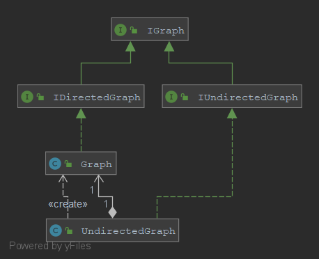

**Nom/Prénom Etudiant 1 : Axel BERTRAND**

**Nom/Prénom Etudiant 2 : Omran HAIDARI**

# Rapport TP1

## Question 1
*Expliquer le code ajouté*

## Question 2
*Expliquer le code ajouté et insérer un schéma du patron de conception mis en place*

Pour l'implémentation de la classe UndirectedGraph, nous avons utilisé le Design Pattern Adapter avec délégation pour ainsi éviter la duplication du code.

Nous avons ajouté dans la classe UndirectedGraph un attribut de type Graph et nous avons utilisé les méthodes déjà créées pour implémenter celles de la classe UndirectedGraph.

## Question 3
*Expliquer le code ajouté et insérer un schéma du patron de conception mis en place*

## Question 4
*Expliquer le code ajouté et insérer un schéma du patron de conception mis en place*

