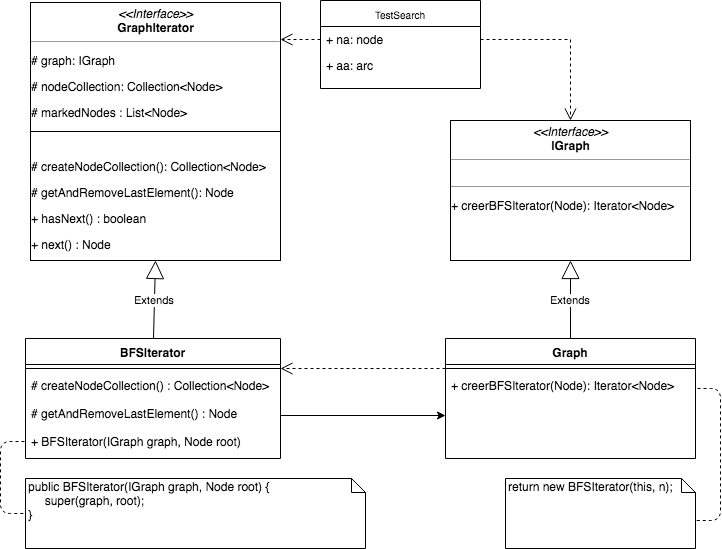

**Nom/Prénom Etudiant 1 : Axel BERTRAND**

**Nom/Prénom Etudiant 2 : Omran HAIDARI**

# Rapport TP1

## Question 1
*Expliquer le code ajouté*

```java
public List<Node> getAllNodes() {
    return new ArrayList<>(adjacence.keySet());
}

public int getNbNodes() {
    return adjacence.size();
}
```

Pour donner la liste des noeuds du graphe, nous avons utilisé la méthode `keySet` sur l'attribut `adjacence` que nous avons encapsulée dans un objet `ArrayList`. L'attribut `adjacence` représente l'ensemble des noeuds du graphe (contenus dans les clés) avec les arcs qui leur sont liés (contenus dans les valeurs).

Le nombre de noeuds est obtenu en utilisant la méthode `size` qui compte le nombre de pairs clé-valeur.

```java
public List<Node> getAdjNodes(Node _n) {
    //A COMPLETER
    if (!adjacence.containsKey(_n)) {
        return null;
    }

    List<Node> listNode = new ArrayList<>();
    for (Arc arc : adjacence.get(_n)) {
        if (arc.getSource().equals(_n)) {
            listNode.add(arc.getDestination());
        }
    }

    return listNode;
}
```

Avant de récupérer tous les noeuds adjacents d'un noeud donné du graphe, on vérifie que ce noeud existe dans le graphe et on renvoie `null` dans le cas contraire.

Puis, on parcourt tous les arcs liés au noeud `_n` et si la source de l'arc est le noeud `_n` alors on l'ajoute à la liste des noeuds adjacents.

On renvoie cette liste quand on a parcouru tous les arcs.

```java
public String toString() {
    //A COMPLETER

    StringBuilder sBuilder = new StringBuilder();
    sBuilder.append("Graph \n");
    for (Node node : adjacence.keySet()) {
        sBuilder.append("[noeud = " + node + " : [");
        String stringifiedArcs = getArc(node).stream().map(Object::toString).collect(joining(", "));
        sBuilder.append(stringifiedArcs + "] \n");
    }

    return sBuilder.toString();
}
```

Dans la méthode `toString`, nous avons utilisé un objet `StringBuilder` pour construire au fur et 
à mesure la représentation textuelle du graphe. Nous avons utilisé le fait que les méthodes `toString` 
pour la classe `Node` et `Arc` étaient déjà implémentées.

Nous avons utilisé l'API Stream de Java parcourir et afficher tous les arcs pour chaque noeud.

## Question 2
*Expliquer le code ajouté et insérer un schéma du patron de conception mis en place*

Pour l'implémentation de la classe UndirectedGraph, nous avons utilisé le Design Pattern Adapter avec délégation 
pour ainsi éviter la duplication du code.

Nous avons ajouté dans la classe UndirectedGraph un attribut de type Graph et nous avons utilisé les méthodes 
déjà créées pour implémenter celles de la classe UndirectedGraph.


## Question 3
*Expliquer le code ajouté et insérer un schéma du patron de conception mis en place*

Afin de réaliser le parcours en largeur sur un graphe, nous avons utilisé le pattern Iterateur afin d'accéder aux 
sommets un par un, dans l’ordre du parcours. Pour le parcours en largeur, on retire le premier élément de la liste, afin
 de prendre les fils des premiers noeuds traités en premier.

Pour cela, nous avons créé la classe BFSIterator qui permet de parcourir la classe Graph et d'accéder à ses éléments. 
Ceci permet ensuite à BFSIterator d'itérer sur la collection d'objets Node en créant une collection de Node de type 
Queue et d'avoir la possibilité de la modifier par la suite. De plus, l’intérêt de ce pattern est d’avoir au final une 
implémentation du parcours pour deux types de graphes différents (orienté et non orienté).

Pour marquer les noeuds déjà traversés lors du pracours, nous avons utilisé un objet Set. Cet objet a l'avantage, par rapport à un objet List, de ne stocker aucun doublon ce qui permet d'être sûr de ne pas marquer un noeud que l'on aurait déjà traversé.



## Question 4
*Expliquer le code ajouté et insérer un schéma du patron de conception mis en place*


Afin de réaliser le parcours en profondeur sur un graphe, nous avons utilisé le pattern Iterateur et créé la classe
DFSIterator, en utilisant le même principe que pour la question précédente, mais avec une collection de Node de type Stack.
Pour le parcours en profondeur, on retire le dernier élément de la liste, afin de prendre les fils des derniers noeuds 
traités en premier.

Pour factoriser le comportement commun aux différents algorithmes de parcours, nous avons utilisé le pattern 
Template Method. Ce pattern permet de fixer les comportements généraux partagés par les sous-classes et de factoriser
du code qui serait redondant dans les deux sous-classes BFSIterator et DFSIterator. Ensuite pour chaque sous-classe, 
il suffit d'implémenter les méthodes abstraites pour qu'elles soient spécifiques à chaque parcours.


